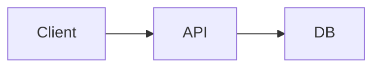

# Архитектура

Краткий обзор архитектуры проекта. Детальные решения — в [ADR](../adr/README.md).

## Обзор

_Опиши основные модули, потоки данных, внешние зависимости._

## Стек

| Слой | Технология |
|------|------------|
| Runtime | _TBD_ |
| БД | _TBD_ |
| CI | GitHub Actions |
| Локальное окружение | Docker Compose |

## Диаграмма (опционально)

## Принципы

- KISS — простейшее рабочее решение
- YAGNI — не строим то, что пока не нужно
- ADR для нетривиальных решений
